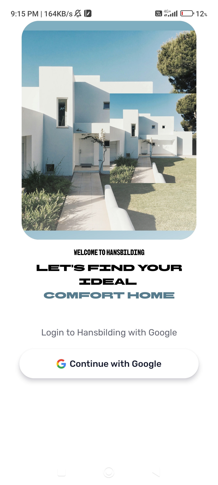
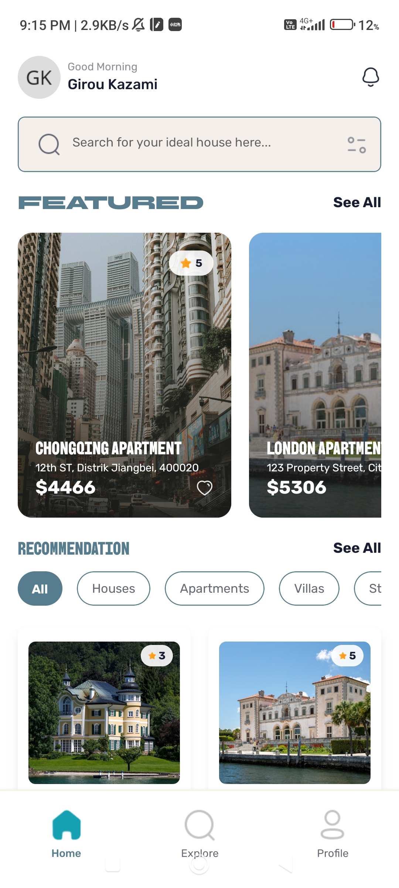
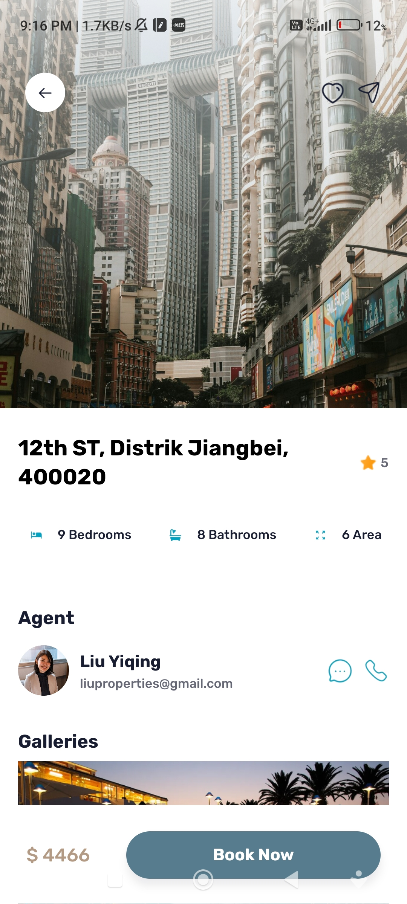
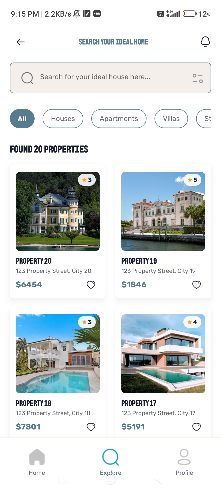

<div align="center">
    <a href="https://www.instagram.com/oblivionnam_?igsh=MTNla2loN2N5NXJjbA==" target="_blank">
      
      
      
      
    </a>
</div>

   <div align="center">
      
      
      
      
      
  </div>


# 🎨 hansbilding | Mobile Application

## 💡 Introduction
#### Mobile Application about properties business with modern design and simple UI that very easy to understand by User.

## 🛠 Tech Stack
+ React Native
+ Typescript
+ Tailwind CSS 3.4.19
+ Expo Go
+ Appwrite

## 🌟 Feature
+ Login and Logout Google Auth
+ Filter Feature
+ Search Feature
+ Horizontal Slide Feature Properties
+ Real Time Price Calculation
+ Preview Book Properties


## 📧 Email: 
[hanifwalian@gmail.com](mailto:hanifwalian@gmail.com)


# Welcome to your Expo app 👋

This is an [Expo](https://expo.dev) project created with [`create-expo-app`](https://www.npmjs.com/package/create-expo-app).

## Get started

1. Install dependencies

   ```bash
   npm install
   ```

2. Start the app

   ```bash
   npx expo start
   ```

In the output, you'll find options to open the app in a

- [development build](https://docs.expo.dev/develop/development-builds/introduction/)
- [Android emulator](https://docs.expo.dev/workflow/android-studio-emulator/)
- [iOS simulator](https://docs.expo.dev/workflow/ios-simulator/)
- [Expo Go](https://expo.dev/go), a limited sandbox for trying out app development with Expo

You can start developing by editing the files inside the **app** directory. This project uses [file-based routing](https://docs.expo.dev/router/introduction).

## Get a fresh project

When you're ready, run:

```bash
npm run reset-project
```

This command will move the starter code to the **app-example** directory and create a blank **app** directory where you can start developing.

## Learn more

To learn more about developing your project with Expo, look at the following resources:

- [Expo documentation](https://docs.expo.dev/): Learn fundamentals, or go into advanced topics with our [guides](https://docs.expo.dev/guides).
- [Learn Expo tutorial](https://docs.expo.dev/tutorial/introduction/): Follow a step-by-step tutorial where you'll create a project that runs on Android, iOS, and the web.

## Join the community

Join our community of developers creating universal apps.

- [Expo on GitHub](https://github.com/expo/expo): View our open source platform and contribute.
- [Discord community](https://chat.expo.dev): Chat with Expo users and ask questions.
